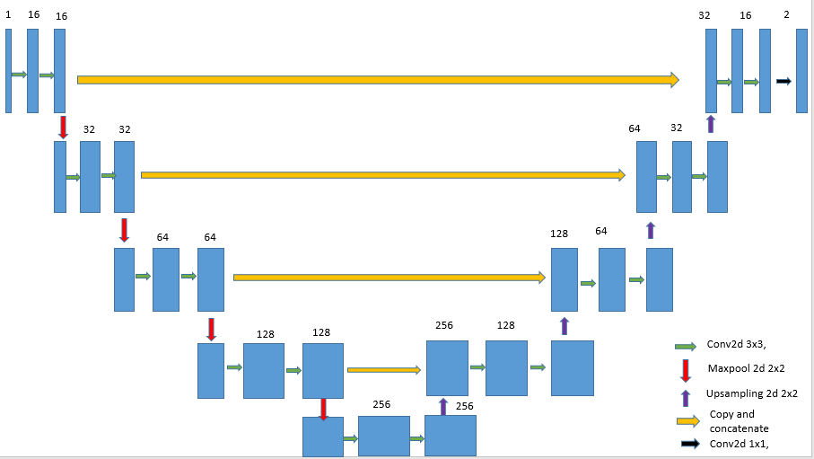

# 2D-flow-prediction
Prediction of 2D steady state flow using deep convolutional neural networks

AIM: 
  This study consists of the devolopment of modern convolutional neural network based surrogate model to predict the flow field of 2D steady state problems with the same accuracy of CFD simulation but at lesser computational efforts. 

  Reference and inspiration for this project were taken from "Guo, Xiaoxiao & Li, Wei & Iorio, Francesco. (2016). Convolutional Neural Networks for Steady Flow Approximation. 481-490. 10.1145/2939672.2939738." Network architecture was modified to improve the accuracy further by using U-Net approach with skip connections. Geometric features were modelled using Binary representation instead of signed distance function as specified in the paper. These changes resulted in increasing the learning capacity which required less than 3000 training images. Original paper used about 100,000 images.
  
DATASET:
  Dataset for training was from Oliver Henningh's database. Training data was in TFrecords format. Instead of feeding all the images at once for training which will result in overload of memory, we used Tensorflow input pipelines to feed input data batch by batch. 
  
 MODEL ARCHITECTURE:
 
 

RESULTS:
